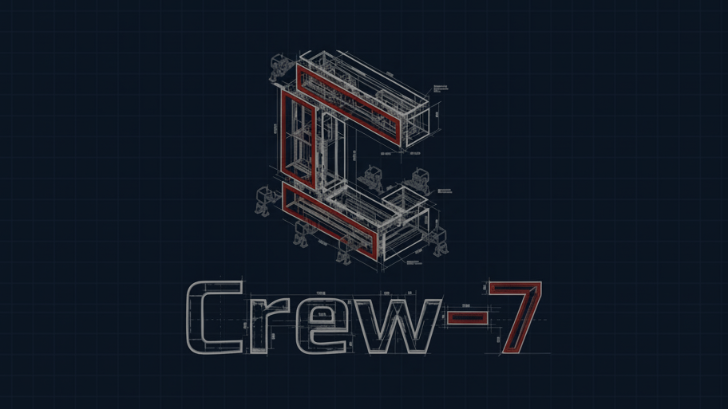

<div align="center">
  
  
  # 🚀 CREW-7
  
  ### *Next-Generation Multi-Agent Orchestration Platform*
  
  [](LICENSE)
  [](https://www.python.org/)
  [](https://fastapi.tiangolo.com/)
  [](https://reactjs.org/)
  [](https://www.typescriptlang.org/)
  
  **Powerful AI agent orchestration with real-time visualization, advanced analytics, and blockchain-ready NFT infrastructure**
  
  [Features](#-features) • [Quick Start](#-quick-start) • [Documentation](#-documentation) • [Architecture](#-architecture)
  
</div>

---

## ✨ Features

<table>
<tr>
<td width="50%">

### 🤖 **Intelligent Agent System**
- **Multi-Agent Orchestration** powered by CrewAI
- **7 Specialized Roles** per crew (Backend, Frontend, QA, DevOps, Data, Security, PM)
- **Dynamic Task Allocation** with real-time handoffs
- **Memory & Context** persistence across missions

</td>
<td width="50%">

### 📊 **Real-Time Visualization**
- **Interactive Graph Canvas** with XYFlow/ReactFlow
- **Live Agent Status** updates via WebSocket
- **Mission Control Dashboard** with analytics
- **Graph Persistence** with auto-save layouts

</td>
</tr>
<tr>
<td width="50%">

### 🔗 **Blockchain Integration**
- **NFT-Ready Infrastructure** for crew tokenization
- **Multi-Chain Support** (Ethereum, Polygon, Base, Arbitrum, Optimism)
- **Rental & Marketplace** system
- **Token Economics** with C7T token

</td>
<td width="50%">

### ⚡ **Enterprise Features**
- **Production-Ready** Docker orchestration
- **Horizontal Scaling** with background workers
- **Observability** via OpenTelemetry + Prometheus
- **Database Migrations** with Alembic

</td>
</tr>
</table>

---

## 🎯 Quick Start

### Prerequisites

```bash
✅ Docker & Docker Compose (v20.10+)
✅ Node.js 18+ (for local development)
✅ Git
⚡ GPU (optional, for Ollama acceleration)
```

### One-Command Setup

```bash
# Clone the repository
git clone https://github.com/ZYNIQ-AI-Driven-Development-Firm/ZYNIQ-CREW-7.git
cd ZYNIQ-CREW-7

# Configure environment
cp .env.example .env
# Edit .env with your API keys and settings

# Launch everything! 🚀
./start.sh
```

**That's it!** The script handles:
- ✅ Environment validation
- ✅ Docker image building
- ✅ Database initialization
- ✅ Migration application
- ✅ User creation
- ✅ Service orchestration
- ✅ Health verification

**First run:** 8-12 minutes (Docker builds)  
**Subsequent runs:** 30-60 seconds (cached images)

### Access Your Platform

| Service | URL | Description |
|---------|-----|-------------|
| 🎨 **Frontend** | http://localhost:3000 | Main application UI |
| ⚡ **API** | http://localhost:8080 | REST API (via Nginx) |
| 📊 **pgAdmin** | http://localhost:5050 | Database management |
| 🗄️ **MinIO** | http://localhost:9001 | Object storage console |
| 📈 **Metrics** | http://localhost:8080/metrics | Prometheus metrics |

**Default Login:**
- Email: `admin@crew7.ai`
- Password: `Admin@123`

---

## 🏗️ Architecture

<details>
<summary><b>📦 Project Structure</b></summary>

```
ZYNIQ-CREW7/
├── 🔧 backend/
│   ├── app/
│   │   ├── routes/           # FastAPI endpoints (REST + WebSocket)
│   │   ├── services/         # Business logic & orchestration
│   │   ├── models/           # SQLAlchemy ORM models
│   │   ├── schemas/          # Pydantic validation schemas
│   │   ├── agents/           # CrewAI agent definitions
│   │   ├── crewai/           # CrewAI integration adapters
│   │   ├── core/             # Security, config, utilities
│   │   ├── infra/            # Infrastructure clients (Redis, S3, Qdrant)
│   │   └── utils/            # Helper functions
│   ├── alembic/              # Database migrations
│   │   ├── versions/         # Migration version files
│   │   └── env.py            # Alembic environment config
│   ├── docker/
│   │   ├── compose.yml       # Service orchestration
│   │   ├── Dockerfile.api    # API container definition
│   │   └── nginx.conf        # Reverse proxy configuration
│   ├── tests/                # Pytest test suite
│   ├── alembic.ini           # Alembic configuration
│   ├── main.py               # FastAPI application entry
│   ├── worker.py             # Background task worker
│   └── requirements.txt      # Python dependencies
│
├── 🎨 frontend/
│   ├── components/           # Reusable React components
│   │   ├── graph/           # XYFlow agent graph visualization
│   │   ├── Dashboard/       # Analytics & metrics dashboard
│   │   ├── Wallet/          # Crypto wallet integration
│   │   └── workspace/       # Code editor & file explorer
│   ├── pages/               # Page-level components
│   │   ├── LandingPageBlueprint.tsx
│   │   ├── Presentation.tsx
│   │   └── MarketplacePage.tsx
│   ├── src/lib/             # API client & utilities
│   ├── styles/              # CSS design system
│   ├── public/              # Static assets
│   ├── Dockerfile           # Frontend container
│   └── package.json         # Node.js dependencies
│
├── 📚 docs/                  # Documentation
│   ├── ENVIRONMENT_CONFIGURATION.md
│   ├── ALEMBIC_MIGRATION_GUIDE.md
│   ├── QUICK_START.md
│   └── API_TEST_REPORT.md
│
├── 🚀 start.sh              # Automated setup script
├── 🧹 cleanup.sh            # Environment cleanup
├── .env.example             # Environment template
└── README.md                # You are here 📍
```

</details>

<details>
<summary><b>🔌 Technology Stack</b></summary>

### Backend

| Category | Technology | Purpose |
|----------|-----------|---------|
| **Framework** | FastAPI | High-performance async web framework |
| **Database** | PostgreSQL 16 | Primary data store |
| **ORM** | SQLAlchemy 2.0 | Database abstraction |
| **Migrations** | Alembic 1.17 | Schema version control |
| **Cache** | Redis | Pub/sub, queues, caching |
| **Vector DB** | Qdrant | Embedding storage & search |
| **Storage** | MinIO (S3) | Artifact & file storage |
| **LLM** | Ollama + GPU | Local LLM inference |
| **AI Framework** | CrewAI | Agent orchestration |
| **Observability** | OpenTelemetry | Distributed tracing |
| **Metrics** | Prometheus | Performance monitoring |
| **Workers** | RQ (Redis Queue) | Background task processing |

### Frontend

| Category | Technology | Purpose |
|----------|-----------|---------|
| **Framework** | React 19 | UI framework |
| **Language** | TypeScript 5.7 | Type-safe JavaScript |
| **Build Tool** | Vite 6 | Fast bundling & HMR |
| **Visualization** | XYFlow/ReactFlow | Interactive graph canvas |
| **Styling** | Tailwind CSS + Custom | Design system |
| **Animation** | anime.js + Lottie | Smooth transitions |
| **State** | React Hooks | Component state management |
| **WebSocket** | Native WebSocket API | Real-time communication |

### Infrastructure

| Component | Service | Configuration |
|-----------|---------|---------------|
| **Container** | Docker | Multi-stage builds |
| **Orchestration** | Docker Compose | Service dependencies |
| **Reverse Proxy** | Nginx | Load balancing, SSL termination |
| **Process Manager** | Gunicorn | WSGI server with workers |
| **ASGI Server** | Uvicorn | High-performance async workers |
| **Database Admin** | pgAdmin 8.12 | Web-based DB management |

</details>

---

## 📚 Documentation

### 🎓 Getting Started
- [Quick Start Guide](docs/QUICK_START.md)
- [Environment Configuration](docs/ENVIRONMENT_CONFIGURATION.md)
- [Setup & Testing](docs/SETUP_AND_TESTING.md)

### 🔧 Development
- [Alembic Migration Guide](docs/ALEMBIC_MIGRATION_GUIDE.md)
- [API Test Report](docs/API_TEST_REPORT.md)
- [Fullstack Crew Testing](docs/FULLSTACK_CREW_TESTING.md)

### 🎨 Frontend
- [Dashboard Improvements](docs/DASHBOARD_IMPROVEMENTS_COMPLETE.md)
- [WebSocket Integration](docs/WEBSOCKET_INTEGRATION.md)
- [Agent Graph Canvas](docs/AGENT_GRAPH_CODE_CANVAS_COMPLETE.md)

### 🚀 Deployment
- [Docker Compose Setup](backend/docker/compose.yml)
- [Nginx Configuration](backend/docker/nginx.conf)
- [Production Checklist](docs/MISSION_COMPLETE.md)

---

## 🛠️ Development Guide

### Database Migrations

When modifying SQLAlchemy models in `backend/app/models/`:

```bash
# 1. Create migration
cd backend
./db-migrate.sh create "add user preferences table"

# 2. Review generated migration
cat alembic/versions/xxxx_add_user_preferences_table.py

# 3. Apply migration
./db-migrate.sh upgrade

# 4. Verify schema
docker-compose exec db psql -U crew7 -c "\d+ user_preferences"

# 5. Rollback if needed
./db-migrate.sh downgrade
```

### API Development

```bash
# Hot-reload API during development
docker-compose up api

# Run tests
cd backend
pytest tests/ -v

# Check code coverage
pytest --cov=app tests/

# Lint code
ruff check app/
```

### Frontend Development

```bash
# Install dependencies
cd frontend
npm install

# Start dev server (outside Docker)
npm run dev

# Build for production
npm run build

# Type checking
npm run type-check

# Lint & format
npm run lint
npm run format
```

### Service Management

```bash
# View logs
docker-compose logs -f api         # API logs
docker-compose logs -f frontend    # Frontend logs
docker-compose logs -f worker      # Background worker logs

# Restart services
docker-compose restart api
docker-compose restart frontend

# Rebuild after code changes
docker-compose up -d --build api

# Clean slate (⚠️ deletes data)
./cleanup.sh --volumes

# Nuclear option (⚠️ removes everything)
./cleanup.sh --all
```

---

## 🔌 API Reference

<details>
<summary><b>🔐 Authentication</b></summary>

```bash
# Register new user
POST /auth/register
{
  "email": "user@example.com",
  "password": "SecurePass123"
}

# Login
POST /auth/login
{
  "email": "user@example.com", 
  "password": "SecurePass123"
}
# Returns: { "access": "jwt_token", "refresh": "refresh_token" }

# Get current user
GET /settings/account
Authorization: Bearer {token}
```

</details>

<details>
<summary><b>🤖 Crews & Agents</b></summary>

```bash
# List all crews
GET /crews

# Get crew details
GET /crews/{crew_id}

# Create new crew
POST /crews
{
  "name": "DevOps Squad",
  "role": "infrastructure"
}

# List crew agents
GET /agents/crews/{crew_id}/agents

# Create agent
POST /agents
{
  "crew_id": "uuid",
  "role": "backend_dev",
  "name": "Senior Backend Developer"
}
```

</details>

<details>
<summary><b>🚀 Runs & Execution</b></summary>

```bash
# Start crew run
POST /runs
{
  "crew_id": "uuid",
  "prompt": "Build a REST API for user management",
  "mode": "chat"
}

# Get run status
GET /runs/{run_id}

# List runs for crew
GET /runs?crew_id={crew_id}&limit=20

# Stream run progress (SSE)
GET /runs/{run_id}/stream

# Control run
POST /graph/runs/{run_id}/pause
POST /graph/runs/{run_id}/resume
POST /graph/runs/{run_id}/cancel
```

</details>

<details>
<summary><b>📊 Analytics & Metrics</b></summary>

```bash
# Dashboard statistics
GET /dashboard/stats

# Token statistics
GET /dashboard/tokens/stats

# Rental statistics  
GET /dashboard/rentals/stats

# Crew portfolio
GET /crews/{crew_id}/portfolio

# Rate crew performance
POST /crews/{crew_id}/rate
{
  "rating": 5,
  "comment": "Excellent work!"
}
```

</details>

<details>
<summary><b>🔌 WebSocket Events</b></summary>

```typescript
// Mission events
WS /ws/mission
Events: { type: "signal" | "alert" | "crew-change", payload: any }

// Agent graph updates
WS /ws/graph
Events: { type: "node_update", agentId: string, status: string }

// Run progress stream
WS /ws/runs/{run_id}
Events: { type: "token" | "tool" | "log" | "metric" | "done" }
```

</details>

---

## 🗄️ Database Schema

<details>
<summary><b>Core Tables</b></summary>

| Table | Description | Key Columns |
|-------|-------------|-------------|
| `users` | User accounts | id, email, org_id, role |
| `wallets` | Crypto wallets | address, chain_type, user_id |
| `crews` | Agent crews | id, name, role, models_json |
| `agents` | Individual agents | id, crew_id, role, specialist_type |
| `runs` | Execution history | id, crew_id, status, prompt |
| `crew_graphs` | Graph layouts | crew_id, graph (JSONB) |
| `crew_portfolios` | Crew performance | crew_id, missions_completed, rating_avg |
| `crew_ratings` | User reviews | id, crew_id, rating, comment |

</details>

<details>
<summary><b>Enum Types</b></summary>

```sql
-- Run status lifecycle
CREATE TYPE runstatus AS ENUM (
  'queued', 'running', 'succeeded', 'failed', 'cancelled'
);

-- Blockchain networks
CREATE TYPE chaintype AS ENUM (
  'ethereum', 'polygon', 'base', 'arbitrum', 'optimism'
);

-- Transaction direction
CREATE TYPE transactiondirection AS ENUM (
  'inbound', 'outbound'
);
```

</details>

---

## 🎨 Design System

### Color Palette

```css
/* Primary Colors */
--crew7-red: #ea2323;        /* Brand primary */
--crew7-blue: #3b82f6;       /* Interactive elements */
--crew7-dark: #0a0e14;       /* Background */
--crew7-slate: #1e2635;      /* Surface */

/* Semantic Colors */
--success: #10b981;          /* Green 500 */
--warning: #f59e0b;          /* Amber 500 */
--error: #ef4444;            /* Red 500 */
--info: #3b82f6;             /* Blue 500 */

/* Text Colors */
--text-primary: #f0f3f9;     /* High emphasis */
--text-secondary: #9099b4;   /* Medium emphasis */
--text-dim: rgba(255, 255, 255, 0.55); /* Low emphasis */
```

### Typography

```css
/* Monospace for tech feel */
--font-mono: 'VT323', 'Courier New', monospace;
--font-sans: -apple-system, BlinkMacSystemFont, 'Segoe UI', sans-serif;

/* Scale */
--text-xs: 0.75rem;
--text-sm: 0.875rem;
--text-base: 1rem;
--text-lg: 1.125rem;
--text-xl: 1.25rem;
--text-2xl: 1.5rem;
```

### Animations

```css
/* Glow effects */
@keyframes c7-glow {
  0%, 100% { box-shadow: 0 0 8px var(--crew7-red); }
  50% { box-shadow: 0 0 16px var(--crew7-red); }
}

/* Typing indicator */
@keyframes c7-typing {
  0%, 100% { opacity: 0.3; }
  50% { opacity: 1; }
}
```

---

## 🔐 Security

- ✅ **JWT Authentication** with HTTP-only cookies
- ✅ **Bcrypt Password Hashing** (cost factor 12)
- ✅ **Org-Level Data Isolation** via RLS policies
- ✅ **Role-Based Access Control** (Owner, Admin, Member, Viewer)
- ✅ **CORS Configuration** for cross-origin requests
- ✅ **SQL Injection Protection** via SQLAlchemy ORM
- ✅ **XSS Prevention** via React auto-escaping
- ⏳ **Rate Limiting** (planned)
- ⏳ **2FA Support** (planned)

---

## 🚀 Roadmap

### Phase 1: Core Platform ✅
- [x] Multi-agent orchestration
- [x] Real-time visualization
- [x] WebSocket integration
- [x] Database migrations
- [x] Docker orchestration

### Phase 2: Enterprise Features 🚧
- [x] Dashboard analytics
- [x] Crew portfolio system
- [x] Rating & reviews
- [ ] Advanced metrics
- [ ] Cost tracking

### Phase 3: Blockchain Integration 📅
- [x] Wallet infrastructure
- [x] Multi-chain support
- [ ] NFT minting
- [ ] Marketplace launch
- [ ] Token economics

### Phase 4: AI Enhancement 📅
- [ ] Advanced prompt engineering
- [ ] Memory optimization
- [ ] Multi-model support
- [ ] Custom agent templates
- [ ] Evaluation framework

---

## 📊 Performance

- **API Response Time:** <100ms (p95)
- **Database Queries:** <50ms (p95)
- **WebSocket Latency:** <20ms
- **Frontend Load Time:** <2s (cached)
- **Docker Build Time:** 8-12min (first), 30-60s (cached)

---

## 📞 Support & Contact

<div align="center">

### 🏢 ZYNIQ Solutions

**Building the Future of AI-Driven Development**

[](https://zyniq.solutions)
[](mailto:admin_ibrahim@zyniq.solutions)
[](https://linkedin.com/company/zyniq)

---

### 🤝 Contributing

This is a proprietary internal project. For contribution guidelines, please contact the team lead.

---

### 📄 License

**Proprietary License**  
© 2025 ZYNIQ Solutions. All rights reserved.

---

### ⭐ Acknowledgments

Built with powerful open-source technologies:
- [CrewAI](https://github.com/joaomdmoura/crewAI) - Multi-agent orchestration
- [FastAPI](https://fastapi.tiangolo.com/) - Modern web framework
- [React](https://reactjs.org/) - UI library
- [XYFlow](https://reactflow.dev/) - Graph visualization
- [PostgreSQL](https://www.postgresql.org/) - Database
- [Docker](https://www.docker.com/) - Containerization

---


**Made with ❤️ by the ZYNIQ Team**

</div>
